# 🎓 Decentralized Academic Identity System

> **Designed & Developed by morningstarxcdcode**


A professional, blockchain-based platform where:

1. **Universities** issue tamper-proof degrees.
2. **Students** store them securely in a digital wallet.
3. **Employers** verify them instantly.

---

## �️ How It Works (The Flow)

```mermaid
graph TD
    A[🎓 University] -->|Issues Credential| B(Blockchain Registry)
    A -->|Uploads Metadata| C(Secure Storage IPFS)
    B -.->|Updates| D[👤 Student Wallet]
    C -.->|Syncs| D
    E[💼 Employer] -->|Verifies Hash| B
    B -->|Returns Valid/Invalid| E
```



### 1. **Issuance** (The University)

The university creates a digital diploma. It records a unique "fingerprint" (hash) on the Blockchain. This makes it permanent and unchangeable.

### 2. **Storage** (The Student)

The student receives the diploma in their dashboard. They own it forever. No one can take it away or lose it.

### 3. **Verification** (The Employer)

An employer checks the diploma by scanning it. The system asks the Blockchain: "Is this real?" and gets an instant "Yes" or "No".

---

## ✅ Project Status Report

What is finished and what is coming next?

| Feature                        | Status       | Notes                                   |
| :----------------------------- | :----------- | :-------------------------------------- |
| **Blockchain Smart Contracts** | 🟢 **DONE**  | Deployment-ready (Solidity).            |
| **Student Dashboard**          | 🟢 **DONE**  | View & Share credentials.               |
| **University Portal**          | 🟢 **DONE**  | Issue degrees & track history.          |
| **Verification System**        | 🟢 **DONE**  | Instant public verification.            |
| **Government Dashboard**       | 🟢 **DONE**  | Manage authorized universities.         |
| **Mobile App**                 | ⚪ _Planned_ | iOS/Android integration coming soon.    |
| **Real Mainnet Deployment**    | ⚪ _Planned_ | Currently running in "Simulation Mode". |

---

## 🚀 How to Run This Project

Follow these simple steps to start the application on your computer.

### Step 1: Install

Open your terminal and run:

```bash
pnpm install
```

### Step 2: Start

Turn on the engine:

```bash
pnpm dev
```

### Step 3: Explore

Open the link shown (usually `http://localhost:5173`) in your browser.

- **Login as University**: Go to the "University" tab to issue a fake degree.
- **Login as Student**: Go to the "Student" tab to see it appear in your wallet.
- **Login as Verifier**: Go to the "Verifier" tab to check if it's real.

---

## 📂 Documentation Links

For more details, check the `docs/` folder:

- **[📘 Project Overview](./docs/Project_Documentation.md)**: Deep dive into the tech.
- **[📂 File Guide](./docs/File_Structure_and_Usage.md)**: Explanation of every file.

---

_© 2025 morningstarxcdcode. All Rights Reserved._
